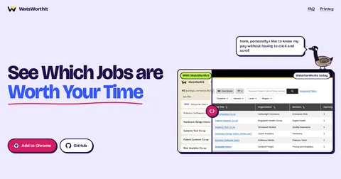
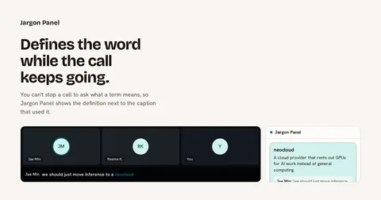
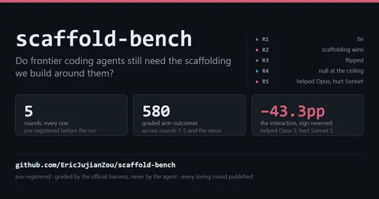
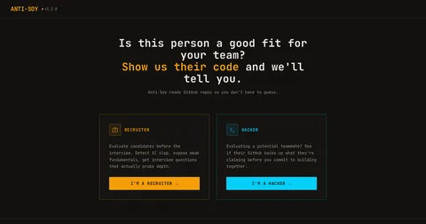

<picture>
  <source media="(prefers-color-scheme: dark)" srcset="assets/banner-dark.svg">
  
</picture>

# Eric Zou

20, Electrical Engineering at Waterloo. I run experiments and like being proven wrong.

Building introspective AI to feel pain and emotions. Spent summer 2026 as a forward deployed engineer at TextNow.

## Ongoing

<table>
<tr>
<td></td>
<td><a href="https://watnow.ugmi.ca"><b>watnow</b></a> is a Chrome extension that reads every course on Learn and answers "what's due this week?" It has 1300 installs.</td>
</tr>
<tr>
<td></td>
<td><a href="https://watsworthit.ugmi.ca"><b>WatsWorthIt</b></a> is a free Chrome extension that shows pay per hour and an ROI score on the WaterlooWorks job table.</td>
</tr>
<tr>
<td></td>
<td><a href="https://test.ericzou.dev/jargon/"><b>Jargon Panel</b></a> is a Chrome side panel that defines jargon next to the Google Meet caption that used it. The waitlist is open.</td>
</tr>
</table>

## Past

<table>
<tr>
<td></td>
<td><a href="https://github.com/EricJujianZou/scaffold-bench"><b>scaffold-bench</b></a> tested whether frontier coding agents still need scaffolding, over five pre-registered rounds. The scaffold won in round five.</td>
</tr>
<tr>
<td></td>
<td><a href="https://antisoy.com"><b>Anti-Soy</b></a> helps non-technical recruiters evaluate candidates from their GitHub code.</td>
</tr>
<tr>
<td></td>
<td><a href="https://github.com/EricJujianZou/ccpet"><b>ccpet</b></a> is a desktop pet that mirrors a live Claude Code session. She types while the agent works and puts her hand up when it needs your approval.</td>
</tr>
</table>

## How I work

Agents on my own harness pick up tickets and open PRs, and I review them. The [skills](https://github.com/EricJujianZou/skills) I run in Claude Code are public:

```
/plugin marketplace add EricJujianZou/skills
/plugin install ez-skills@ez
```

## Talk to me

I'm working on design and distribution right now and want to hear from design, product and marketing people. [Book 20 minutes](https://calendly.com/ericzou/chat) or email e2zou@uwaterloo.ca.

Writing at [ericzou.dev](https://ericzou.dev). [Resume](https://ericzou.dev/assets/Eric_Zou_Resume_FDE_2027.pdf).
