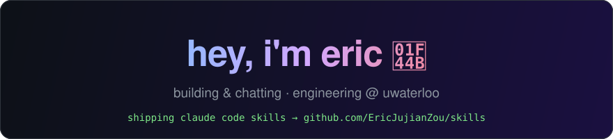

<div align="center">



[](https://x.com/SleppyEric)
[](https://github.com/EricJujianZou/skills)


</div>

## currently building

- **[skills](https://github.com/EricJujianZou/skills)** — Claude Code skills as an installable plugin. flagship: **brainrotifier**, which patches AI-slop writing into certified gen z brainrot (`delve into` → `lock in on`, em dashes do not survive)
- **[agentic-sdlc](https://github.com/EricJujianZou/agentic-sdlc)** — my agentic software development lifecycle, so every future project builds itself faster
- **[scholarship-factory](https://github.com/EricJujianZou/scholarship-factory)** — auto scrape, parse, and apply to opportunities
- **[optimal](https://github.com/EricJujianZou/optimal)** — make the right choice, anytime, anywhere

## try my claude code skills

```
/plugin marketplace add EricJujianZou/skills
/plugin install ez-skills@ez
```

then tell claude to "rizz this up" and thank me later.

## stats

<p>
  
  
</p>

---

<sub>this profile contains zero em dashes. certified slop-free by <a href="https://github.com/EricJujianZou/skills">brainrotifier</a>.</sub>

